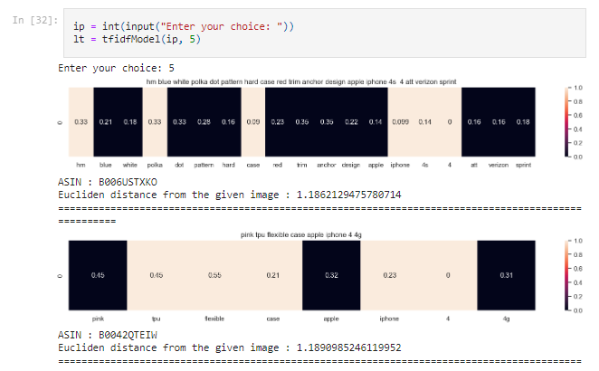

# Review-Based-Recommendation-System

A recommendation system for amazon products.
It uses Python and various NLP libraries, such as NLTK to analyze the reviews and products and match them based on their similarity. The project aims to provide a personalized and user-friendly way to discover and compare Amazon products.

<center>
    
</center>

## Tech-Stack

- Python

## Features

- The notebook allows the user to enter a product name that they are interested in.
- The notebook extracts the reviews of that product and performs NLP tasks, such as tokenization, lemmatization, stopword removal, sentiment analysis, etc.
- The notebook uses the cosine_similarity and pairwise distance model to create word embeddings for the reviews and the product descriptions and calculates their cosine similarity.
- The notebook then recommends the top 5 products that are most similar to the selected product based on the reviews and product descriptions.

## Installation and Usage

To install and run this project, you need to have Python 3 installed on your computer. You also need to install and import the following Python libraries:

- flask
- nltk
- seaborn
- pandas
- requests

You can use any IDE or editor of your choice.

To download the code and data files for this project, you can clone this GitHub repository using the following command:

```https://github.com/Amritha-07/Review-Based-Recommendation-System.git```

## References

This project dataset was from the following sources:

- [Customer reviews of amazon products Dataset](https://www.kaggle.com/datasets/datafiniti/consumer-reviews-of-amazon-products/data) from kaggle
